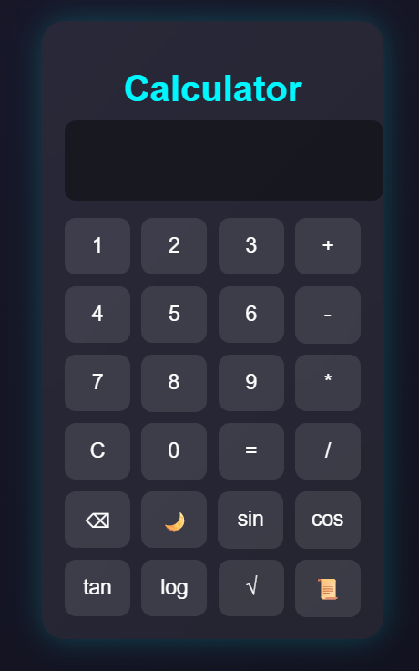

# CodeAlpha_tasks
# CodeAlpha_Calculator

A modern, responsive, and feature-rich scientific calculator built using HTML, CSS, and JavaScript.

This calculator supports both basic and advanced scientific operations with a clean user interface and smooth functionality.

---

## Features

### Basic Operations
- Addition (+)
- Subtraction (-)
- Multiplication (*)
- Division (/)

### Scientific Functions
- Sin (sin)
- Cos (cos)
- Tan (tan)
- Logarithm (log)
- Square Root (√)

### Extra Features
- Dark Mode 🌙
- Keyboard Input Support ⌨️
- Calculation History 📜
- Responsive Design 📱
- Interactive User Interface ✨

---

## Technologies Used

- HTML5
- CSS3
- JavaScript (ES6)

---

## How to Use

1. Clone the repository
2. Open `index.html`
3. Start calculating

---

## Screenshot

---

## Future Improvements

- Memory Functions
- Scientific Constants
- Better Animations
- Voice Input Support

---

## Live Demo

Add your Vercel or Netlify deployment link here

---

## Author

Kainat Tariq  
GitHub: https://github.com/kainattariq001
